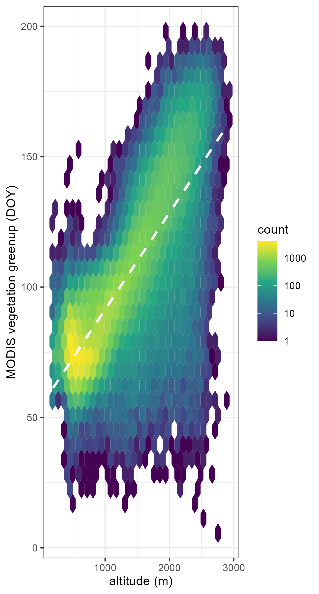

## 8.1.1 Physical geography and phenology

1. What does the intercept indicate?

The intercept indicates the value of the outcome (DOY) when the predictor (altitude) is zero.

2. How can you interpret the slope?
```{r}

```

With higher altitude, the DOY increases (~37 days per 1'000 m of elevation gain), meaning the vegetation greenup is later in the year.

3. How to convert the established relationship with altitude, to one with temperature (Without actually doing it, just describe how you would go about this and what you would expect? Can you approximate the effect of 1 degree of warming?)

Depending on the atmosphere's local water content, air temperature decreases by 0.5 - 1.0 °C per 100 meters of elevation. This relationship could be used to create a model which would predict the change of time in the local vegetation greenup - say the temperature rises by 1 °C (and the atmosphere is dry), then the vegetation greenup would occur ~3.7 days earlier.

# 8.1.2 Temporal and spatial anomalies

For a location near the Adirondacks in the North-Eastern United States (Figure 8.1) gather phenology data on both the day of greenup and the day of maximum canopy development of a location centered on 43.5
N and 74.5
W. Use a product that directly provides these quantities. Gather data for all pixels 100 km around this location for years 2001 to 2010. Ensure you have the right region, e.g. by plotting it terra::plot(your_raster). Similarly, download land cover data for the year 2010 for the same spatial extent, and only consider IGBP broadleaf and mixed forest classes in your analysis.

For the years 2001 - 2009 calculate the long term mean (LTM) and standard deviation (SD) of the phenology metrics. Calculate location with an early greenup for 2010 (< LTM - 1 SD) and locations with late maturity (> LTM + 1 SD).

Describe the observed patterns and speculate about the underlying reasons. In addition, download a digital elevation map for the United States (30s resolution), and compare differences in altitude (e.g. a boxplot) across locations where you do or do not see any patterns in phenology.

## Code
##Setup
```{r}
library(MODISTools)
library(terra)
library(tidyverse)
library(geodata)
library(tmap)

# --- Parameter ---
lat <- 43.5
lon <- -74.5
years <- 2001:2010
```
##Daten einlesen
```{r}
phenology <- read.csv("data-raw/phenology.csv")
land_cover <- read.csv("data-raw/land_cover.csv")
```

##Daten Aufbereiten
```{r}
phenology <- phenology %>%
  mutate(
    value = ifelse(value > 30000, NA, value),
    doy   = as.numeric(format(as.Date("1970-01-01") + value, "%j")),
    year  = as.numeric(substr(calendar_date,1,4))
  )

greenup <- phenology %>% filter(band=="Greenup.Num_Modes_01")
maturity <- phenology %>% filter(band=="Maturity.Num_Modes_01")

greenup_raster <- mt_to_terra(greenup, reproject=TRUE)
maturity_raster <- mt_to_terra(maturity, reproject=TRUE)
```


##Land Cover (Wald) Maske erstellen
```{r}
lc_raster <- mt_to_terra(land_cover, reproject = TRUE)
mask_forest <- lc_raster %in% c(4,5)
```

## DOY-Raster erstellen
```{r}
# Werte in DOY umwandeln

# Use raw (unmasked) rasters as source for DOY conversion
greenup_raw  <- mt_to_terra(greenup,   reproject = TRUE)
maturity_raw <- mt_to_terra(maturity,  reproject = TRUE)

# Convert the full values matrix (preserves spatial order)
to_doy_matrix <- function(r) {
  v <- values(r)                         # N-cells × L-layers matrix
  v[v > 30000] <- NA
  matrix(
    as.numeric(format(as.Date("1970-01-01") + as.vector(v), "%j")),
    nrow = nrow(v), ncol = ncol(v)
  )
}

greenup_raster_doy  <- greenup_raw
maturity_raster_doy <- maturity_raw
values(greenup_raster_doy)  <- to_doy_matrix(greenup_raw)
values(maturity_raster_doy) <- to_doy_matrix(maturity_raw)

# Re-align mask grid (MCD12Q1 and MCD12Q2 may not snap perfectly after reproject)
mask_forest_aligned <- resample(mask_forest, greenup_raster_doy, method = "near")

# Apply mask AFTER DOY conversion
greenup_raster_doy  <- mask(greenup_raster_doy,  mask_forest_aligned, maskvalues = FALSE)
maturity_raster_doy <- mask(maturity_raster_doy, mask_forest_aligned, maskvalues = FALSE)
# --- LTM und SD 2001-2009 ---
greenup_hist <- greenup_raster_doy[[1:9]]
maturity_hist <- maturity_raster_doy[[1:9]]

greenup_ltm <- mean(greenup_hist, na.rm=TRUE)
greenup_sd  <- terra::app(greenup_hist, sd, na.rm=TRUE)
maturity_ltm <- mean(maturity_hist, na.rm=TRUE)
maturity_sd  <- terra::app(maturity_hist, sd, na.rm=TRUE)

# --- Abweichungen 2010 ---
greenup_2010 <- greenup_raster_doy[[10]]
maturity_2010 <- maturity_raster_doy[[10]]

early_greenup <- greenup_2010 < (greenup_ltm - greenup_sd)
late_maturity  <- maturity_2010 > (maturity_ltm + maturity_sd)

# --- Kontrolle Plot ---
par(mfrow=c(1,2))
terra::plot(early_greenup, main="Early Greenup 2010")
terra::plot(late_maturity, main="Late Maturity 2010")
```

##Greenup und Maturity vs. 
```{r}
dem_us <- geodata::elevation_30s(country="USA", path=tempdir())
dem_us <- terra::project(dem_us, crs(greenup_raster))
dem_resampled <- terra::resample(dem_us, greenup_raster_doy[[10]], method="bilinear")

dem_early <- terra::mask(dem_resampled, early_greenup, maskvalues = 0)  # keep TRUE cells only
dem_late  <- terra::mask(dem_resampled, late_maturity,  maskvalues = 0)

vals_early <- as.numeric(terra::values(dem_early, na.rm=TRUE))
vals_late  <- as.numeric(terra::values(dem_late, na.rm=TRUE))
neither <- mask_forest_aligned & !early_greenup & !late_maturity
dem_rest <- terra::mask(dem_resampled, neither, maskvalues = FALSE)
vals_rest <- as.numeric(terra::values(dem_rest, na.rm = TRUE))

vals_early <- if(length(vals_early)==0) NA else vals_early
vals_late  <- if(length(vals_late)==0) NA else vals_late
vals_rest  <- if(length(vals_rest)==0) NA else vals_rest

boxplot(vals_early, vals_late, vals_rest,
        names=c("Early Greenup","Late Maturity", "not affected"),
        main="Elevation vs. Phenology Patterns",
        ylab="Elevation (m.a.s.l.)")
```

```{r}
tmap_mode("plot")

tm <- tm_tiles("OpenStreetMap") +
  tm_shape(ifel(as.numeric(mask_forest_aligned) == 1, 1, NA)) +
    tm_raster(palette = "green", alpha = 1, title = "Forest Mask") +
  tm_shape(ifel(as.numeric(early_greenup) == 1, 1, NA)) +
    tm_raster(palette = "orange", alpha = 1, title = "Early Greenup") +
  tm_shape(ifel(as.numeric(late_maturity) == 1, 1, NA)) +
    tm_raster(palette = "red", alpha = 1, title = "Late Maturity") +
  tm_title("Phenology Patterns 2010")

tm
``` 
A large part of the examined forested area was subjected to early greenup when compared to the long term trend from 2001 to 2009. There is a regional occurrence of late maturity as well as neither early greenup nor late maturity. When looking at the boxplot relating the phenology patterns to elevation, it is apparent that the areas with phenology consistent with the long term mean are situated in locations with higher elevation - possibly counteracting the early greenup caused by rising temperatures through colder temperatures due to higher elevation. Areas of late maturity are situated just a little lower than areas of early greenup, which may indicate another cause than elevation for their differing phenology.


